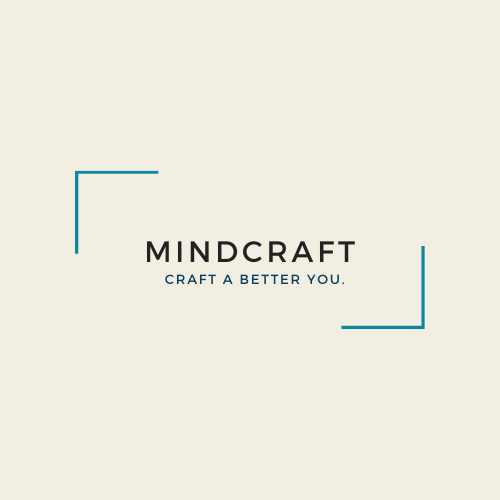
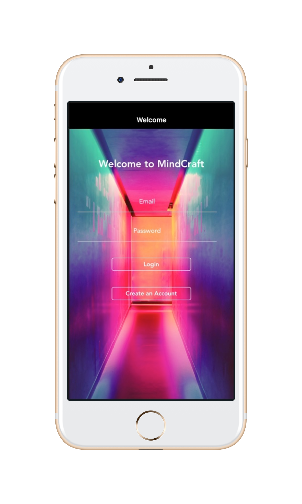
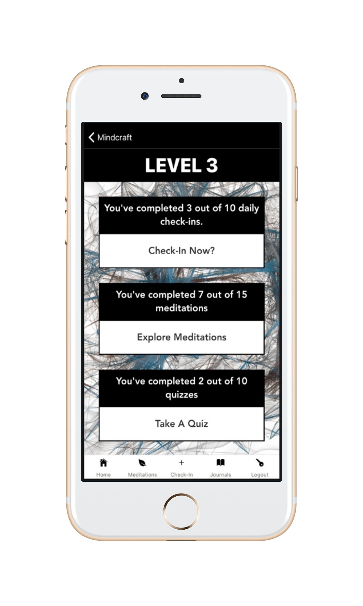
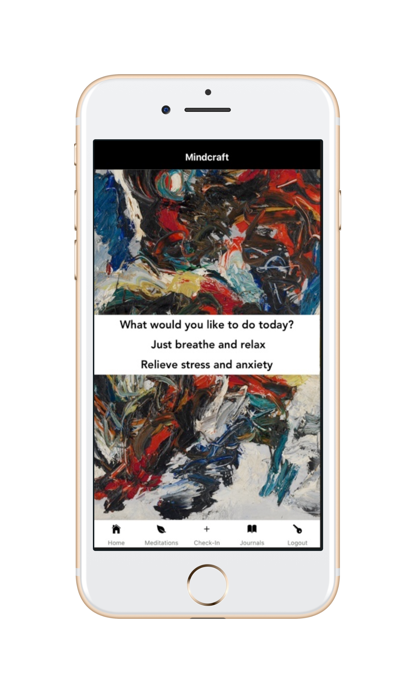

# MINDCRAFT

Mindcraft is a mindfulness and skill-learning app focused on mental health for people
in the tech industry. Users are able to take DBT quizzes that are centered around various skill sets and 
receive feedback on their responses. 
Users graduate to different levels based on their performance on these quizzes as well as through daily check-ins,
and completing a certain amount of journal entries and meditations. 

# Technologies

React-Native, Expo, Sequelize,Postgres, Heroku, Express, Redux

# Screenshots

